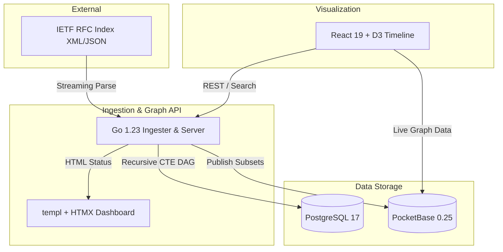

# ⏳ tm3l-protocol-time-machine

> **Interactive visual history of how Internet protocols actually evolved — and why.**

[](LICENSE)
[](go.mod)
[](explorer/package.json)

---

## 📖 Table of Contents
1. [Overview](#-overview)
2. [Architecture](#-architecture)
3. [Tech Stack](#-tech-stack)
4. [Getting Started](#-getting-started)
5. [Documentation](#-documentation)

---

## 🌟 Overview
Automated ingestion of 9,000+ IETF RFCs (from ARPANET 1969 to modern HTTP/3 and QUIC). It builds an interactive directed evolution tree mapping `Updates`, `Obsoletes`, and normative `References`, visualized through a dynamic D3 timeline.

## 📊 Architecture



## 🛠 Tech Stack
- **Ingestion & API**: Go 1.23
- **Admin UI**: `templ` + `HTMX`
- **Visualization UI**: React 19 + TypeScript + Vite 6 + D3.js
- **Databases**: PostgreSQL 17 (Primary Graph Store) + PocketBase 0.25 (Edge/Real-time)

## 🚀 Getting Started
```bash
git clone https://github.com/tm3l/tm3l-protocol-time-machine.git
cd tm3l-protocol-time-machine
make docker-up
```
Visit `http://localhost:5176` to interact with the protocol timeline.

## 📚 Documentation
See [`docs/architecture.md`](docs/architecture.md) for detailed internals.
