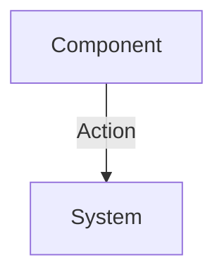

# ODR-000: [Record Title]

## 1. Context & Problem Statement
[Rigor Required: Describe the technical, business, or operational problem that requires a decision. Provide enough background that a new engineer reading this 2 years from now will understand the constraints we operated under. 

This section must be deeply analytical. Do not just state the problem in one sentence. Detail the symptoms, the root causes, and the business impact if this problem is not solved. Discuss the current state of the architecture and why it is failing to meet the evolving demands of the system. Are we hitting throughput limits? Are we experiencing split-brain scenarios? Are there security vulnerabilities exposed by the current topology? 

Minimum record word count is 150 words. The automated auditor (`audit_repo.py`) will mathematically reject any decision record that attempts to pass a shallow, 50-word stub. Knowledge rot is unacceptable in the TM3L enterprise framework.]

## 2. Decision Options & Alternatives Considered
- **Option A (Chosen)**: [Detailed explanation of the chosen architecture/pattern. Explain exactly how it solves the constraints outlined in the context phase.]
- **Option B (Rejected)**: [Why did we reject this? E.g., Postgres RLS was rejected in favor of SQLite WAL due to latency requirements. You must document rejected options to preserve negative knowledge and prevent future engineers from attempting the same doomed path.]
- **Option C (Rejected)**: [Another alternative.]

## 3. Selected Decision
[What exact pattern, tool, or boundary are we adopting? Be extremely specific. If applicable, include a Mermaid diagram mapping the data flow or system architecture. Visual architecture guarantees alignment.]

## 4. Consequences & Trade-offs
[What limitations, technical debt, and ongoing maintenance obligations are we accepting by making this decision? Every architectural choice has a consequence. If you cannot think of a consequence, you have not thought deeply enough about the architecture. Do we increase deployment complexity? Do we lose ACID compliance in exchange for availability? Document the exact cost of this decision here.]
